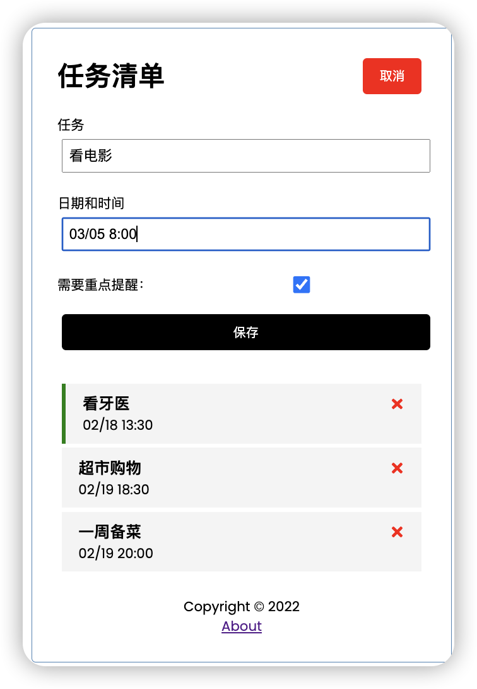
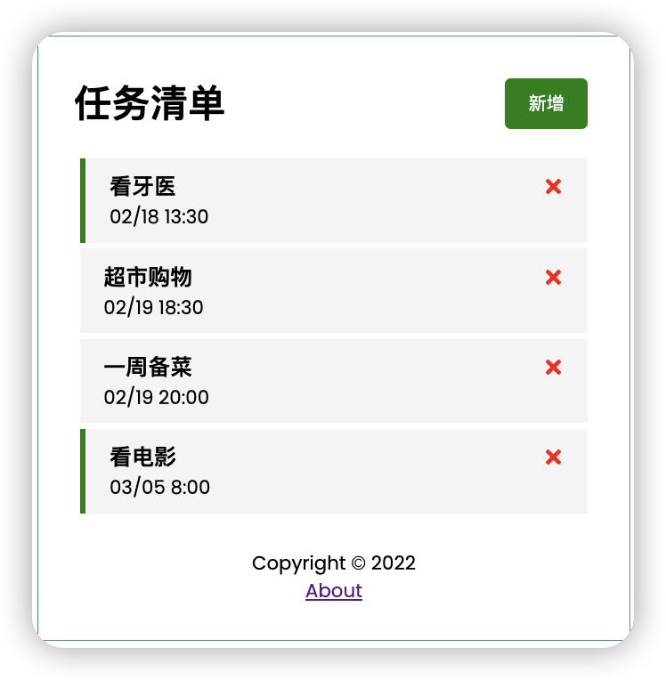

## 基于 React + JSON Server 的任务清单

预览效果[查看在线版本](https://gifted-pare-0363a7.netlify.app/):
 | 
---|---

启动：

```
npm start
npm run server
```

部署：

```
npm run build
```

技术栈：

- bootstrap: Create React App
- useEffect & useState Hook,
- JSON Server, Fetch tasks from server
- Route
